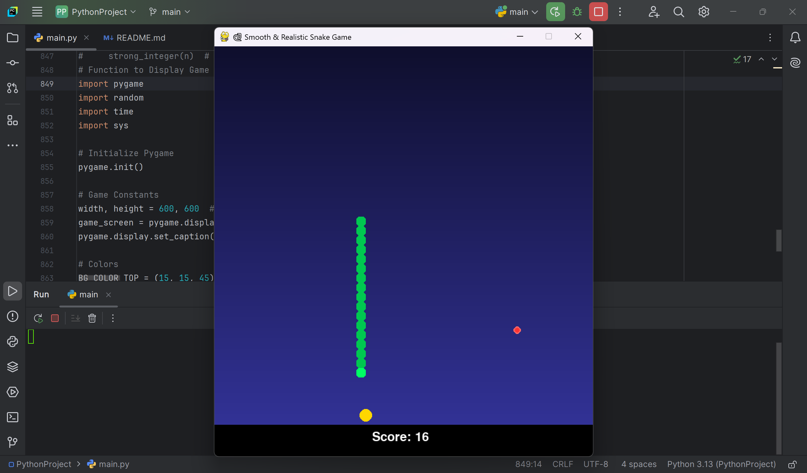

# 🐍 Python Snake Game Project 🎮

A modern twist on the classic Snake Game built using **Python** and the **Pygame** library. This project showcases my skills in **Python programming, game development, and handling real-time events**.

---

## 📌 Project Overview  
This **Python Snake Game** is a fun, interactive game where the player controls a growing snake to collect food while avoiding collisions with its own body and the walls. The game includes a special **Big Balloon** feature for bonus points, adding an extra challenge and excitement to the gameplay.

---

## 🛠️ Tech Stack

- **Programming Language:** Python 🐍  
- **Library Used:** `pygame` 🎮  
- **Development Environment:** VS Code / PyCharm (or any Python IDE)  

---

## ✨ Key Features  

- 🐍 **Classic Snake Game Mechanics:** Navigate the snake to eat food and grow longer.  
- 🏆 **Score Tracking System:** Displays the current and highest scores.  
- 🎮 **Smooth Controls:** Arrow keys for navigation with responsive gameplay.  
- 🖥️ **Cross-Platform Support:** Compatible with **Windows, macOS, and Linux**.  
- 🎈 **Big Balloon Feature:** Collect the Big Balloon to score **5 points at once** at regular intervals.  
- 🚫 **Collision Detection:** Ends the game if the snake collides with itself or the wall.  
- 🔄 **Restart Option:** Allows players to restart the game without closing the application.  

---

## 🖥️ How to Play

1. **Start the Game:** Run the game script and press any key to start.  
2. **Control the Snake:**  
   - Use **arrow keys** to move (Up, Down, Left, Right).  
   - Avoid colliding with the snake’s body or walls.  
3. **Score Points:**  
   - Eat food to grow longer and score points.  
   - Collect the **Big Balloon** for a bonus of **5 points**! 🎈  
4. **Pause & Resume:**  
   - Press the **Space Bar** to pause/resume the game.  
5. **Restart or Exit:**  
   - Press **R** to restart the game after a collision.  
   - Press **Escape** to exit the game.  

---

